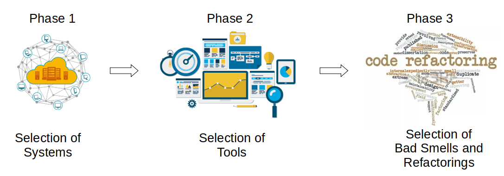
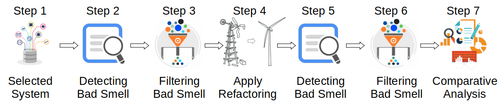
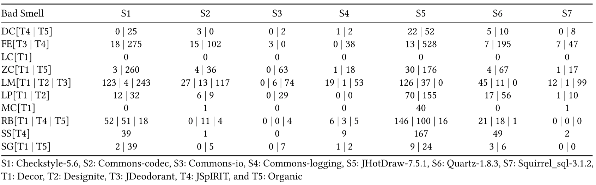
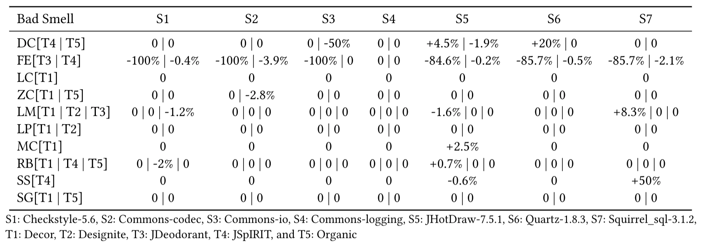
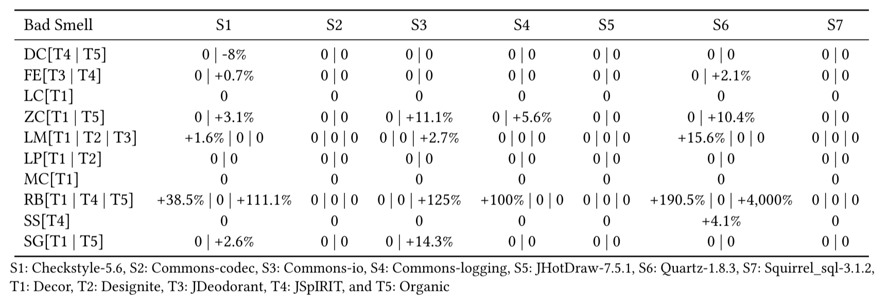

## Analyzing the Impact of Refactoring on Bad Smells

This webpage containing the data of the empirical research conduct: (i) all systems analyzed, (ii) all data detected by the refactoring tools, (iii) all versions of the refactored systems, (iv) notes of particular cases, and (v) all analyses carried out to assess the impacts caused by the applied refactorings.

### Abstract

Refactoring aims to remove bad smells and increase software maintainability by improving the software structure without changing its behavior. However, some studies show that refactoring tools may introduce new bad smells into the source code, but to the best of our knowledge, we have not been able to find a complete catalog that states the bad smells introduced from refactoring. To bridge this gap, this paper goal is to evaluate the impacts of refactoring on the detection of bad smells in open-source Java systems. Hence, we want to know if and when the automated refactoring removes or introduces bad smells.

### Research Phases

### Refactorings Applied

| System            | Move Method | Replace Refactoring | Total |
|:------------------|:-----------:|:-------------------:|:-----:|
|Checkstyle-5.6     | 18          | 5                   | 33    |
|Commons-codec      | 15          | 0                   | 15    |
|Commons-io         | 3           | 2                   | 05    |
|Commons-logging    | 0*          | 1                   | 01    |
|JHotDraw-7.5.1     | 13          | 0*                  | 13    |
|Quartz-1.8.3       | 6           | 11                  | 17    |
|Squirrel_sql-3.1.2 | 6           | 0*                  | 06    |
|Total              | 61          | 19                  | 80    |

* Replace Refactoring - Replace Type Code with State/Strategy and Replace Conditional with Polymorphism

### Bad Smells Detected by Tools

| Abbreviation | Bad Smell              | T1 | T2 | T3 | T4 | T5 |
|:-------------|:----------------------:|:--:|:--:|:--:|:--:|:--:|
| DC           | Data Class             |    |    |    | *  | *  |
| FE           | Feature Envy           |    |    | *  | *  |    |
| LC           | Large Class            | *  |    |    |    |    |
| ZC           | Lazy Class             | *  |    |    |    | *  |
| LM           | Long Method            | *  | *  | *  |    |    |
| LP           | Long Parameter List    | *  | *  |    |    |    |
| MC           | Message Chains         | *  |    |    |    |    |
| RB           | Refused Bequest        | *  |    |    | *  | *  |
| SS           | Shotgun Surgery        |    |    |    | *  |    |
| SG           | Speculative Generality | *  |    |    |    | *  |
|              | Total                  | 7  | 2  | 2  | 4  | 4  |

* T1: Decor, T2: Designite, T3: JDeodorant, T4: JSpIRIT, and T5: Organic

### Impacts Assessment

#### Original Detection

#### Bad Smells Detected After Move Method

#### Bad Smells Detected After Replace Refactoring

### Files

- [Selected Systems](https://drive.google.com/drive/folders/1DZDlox9jN-2Y_OFXnvj0S7x69jQ5ktH9?usp=sharing) - This link contain the original version and all refactored versions

- [Detected Bad Smells](files/Smells.zip) - This link contain the Bad Smells detected by the five tools in the original and refactored version

- [Applied Refactorings](files/Refactoring.zip) - This link contain all refactorings applied with the annotations in some ajusts make by Eclipse IDE and a summarization of the refactorings applied

- [Comparative Analysis](files/Analysis.zip) - This link contain the comparative analysis between original and refactored versions

#### Involved People
- [Cleiton Tavares](http://labsoft.dcc.ufmg.br/doku.php?id=people:students:cleiton_silva) | cleitonsilvatavares@gmail.com | cleiton.silva@dcc.ufmg.br
- [Mariza Bigonha](https://homepages.dcc.ufmg.br/~mariza/) | mariza@dcc.ufmg.br
- [Eduardo Figueiredo](https://homepages.dcc.ufmg.br/~figueiredo/) | figueiredo@dcc.ufmg.br

#### Publication
Brazilian Symposium on Software Engineering (SBES)

34th Brazilian Symposium on Software Engineering

2020
